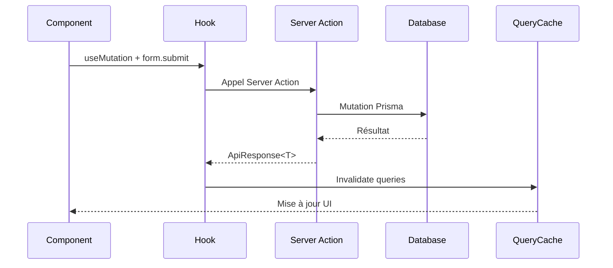
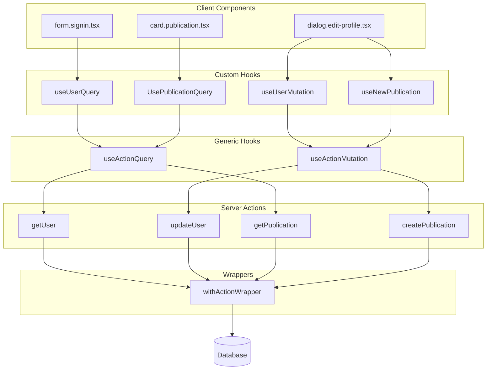
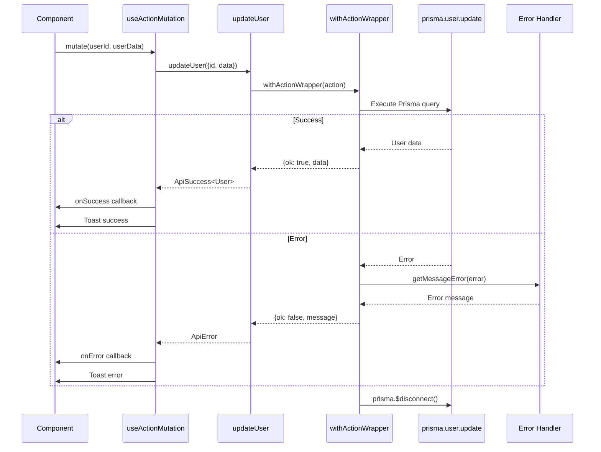
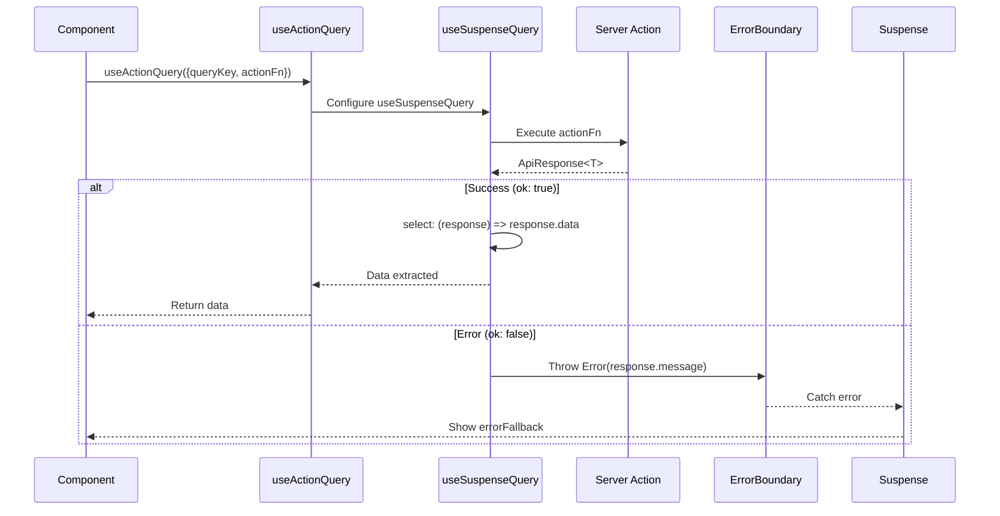
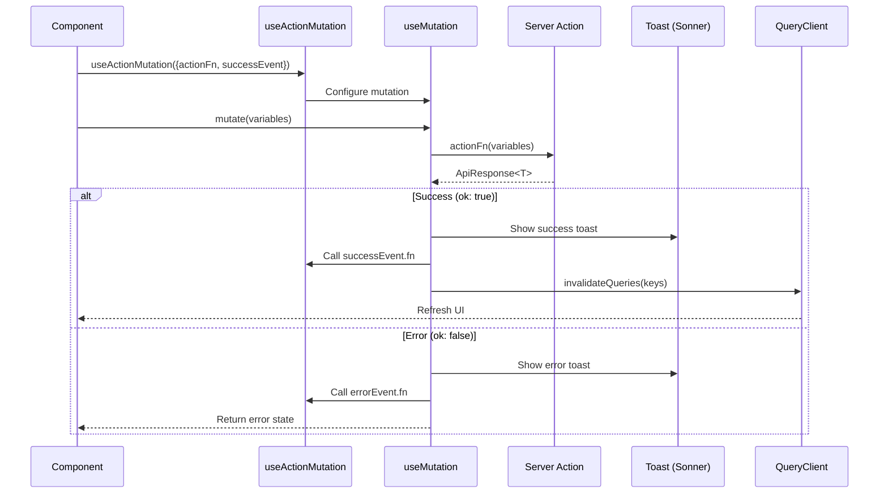
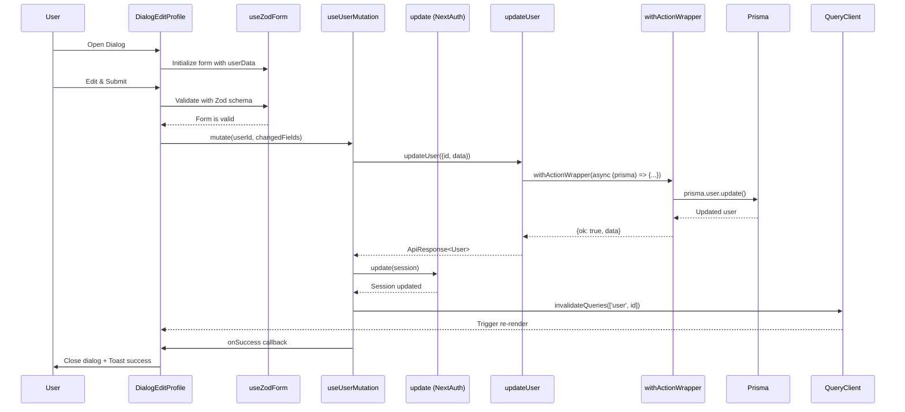
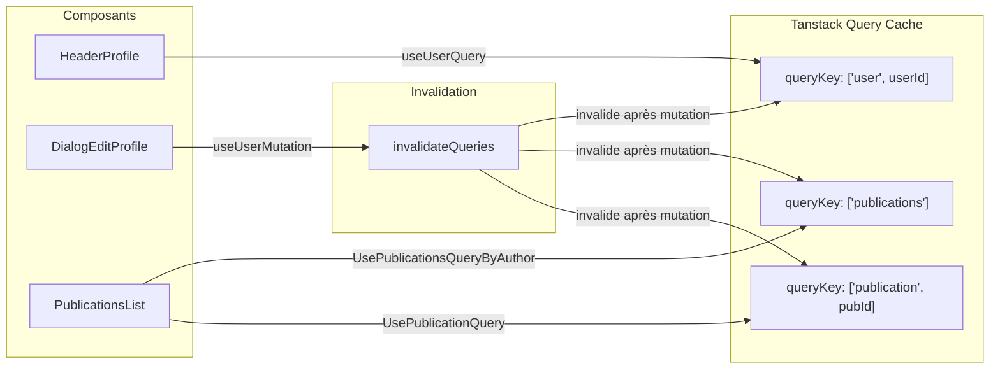

# next-boilerplate

A fullstack boilerplate for creating modern applications with Next.js, including authentication, advanced state management, and optimized architecture.

This boilerplate is based on a social network model because it represents the ideal use case to demonstrate various types of technical operations: CRUD operations (user profiles, posts), data fetching with pagination and streaming (feeds, comments), real-time updates (notifications), file handling (images, avatars), complex authentication flows, and even payment integrations for premium features (TODO). This makes it a comprehensive example that can be adapted to virtually any type of web application.

## Table of Contents

- [Motivation](#motivation)
- [Technologies](#main-technologies)
- [Architecture](#architecture)
  - [Folder Structure](#folder-structure)
  - [Naming Conventions](#naming-conventions)
- [Routing Schema](#routing-schema)
- [Features](#features)
- [Diagrams](#diagrams)
    - [Mutations and Invalidation](#mutations-and-invalidation)
    - [Hooks and Server Actions Architecture](#hooks-and-server-actions-architecture)
    - [`withActionWrapper` Workflow](#withactionwrapper-workflow)
    - [`useActionQuery` Hook Detail](#useactionquery-hook-detail)
    - [`useActionMutation` Hook Detail](#useactionmutation-hook-detail)
    - [Example: User Profile Update](#example-user-profile-update)
    - [Example: Caching System in `/user/<pseudo>` Page](#caching-system-in-userpseudo-page)
- [TODO](#todo)

## Motivation

1. **Stay up-to-date**: Maintain an up-to-date codebase with the latest versions of modern technologies
2. **Experimentation**: Serve as a playground to test and implement new architectures and patterns
3. **Reusable solutions**: Develop and document solutions to common problems (authentication, state management, error boundaries, etc.)
4. **Best practices**: Implement best practices in project structure, React patterns, and full-stack architecture

## Technologies

- **TypeScript** - Static typing for JavaScript
- **Next.js 15** - React framework with server rendering and API routes
- **React 19** - UI library

- **Prisma** - Modern ORM for TypeScript
- **MySQL** - Relational database
- **NextAuth.js** - Complete authentication solution
- **Tanstack Query** - Server state management and caching
- **Server Actions** - Native Next.js server actions

- **TailwindCSS** - Utility-first CSS framework
- **Shadcn/UI** - Reusable UI components
- **Radix UI** - Accessible component primitives
- **Next Themes** - Theme management
- **Sonner** - Toast notifications
- **Lucide React** - Icons

- **React Hook Form** - Form management
- **Zod** - TypeScript-first schema validation
- **Shext** - React Hook Form utilities

- **Biome** - Linter and formatter
- **Husky** - Git hooks
- **bun** - JavaScript runtime

## Architecture

### Folder Structure

```
src/
├── actions/               # Server actions by entity
│   ├── publication/       # Publication actions
│   │   ├── create.ts      # Publication creation
│   │   └── get.ts         # Publication retrieval
│   └── user/              # User actions
│       ├── create.ts
│       ├── get.ts
│       └── update.ts
├── app/                   # Next.js App Router routes
│   ├── (logged)/          # Protected routes
│   │   ├── publications/
│   │   └── user/
│   ├── api/               # API Routes
│   └── signin/            # Public route
├── components/            # React components
│   ├── publications/      # Publication-related components
│   ├── shared/            # Shared components
│   ├── signin/            # Sign-in components
│   ├── ui/                # shadcn/ui components
│   └── user/              # User components
├── hooks/                 # Custom React hooks
│   ├── use-publication.ts # Each entity has its own hook
│   ├── use-user.ts
│   └── use-action.ts      # Generic hook used by entity hooks
├── lib/                   # Utilities and configurations
│   ├── action-wrappers.ts
│   ├── auth.ts
│   ├── prisma.ts
│   └── utils.ts
├── styles/                # Global styles
└── types/                 # TypeScript types
```

### Naming Conventions

- **Files**: kebab-case (`dialog.edit-profile.tsx`)
- **Components**: PascalCase (`DialogEditProfile`)
- **Types**: PascalCase (`PublicationWithAuthor`)
- **Hooks**: camelCase with `use-*` prefix (`useUserQuery`)
- **Server Actions**: camelCase (`createPublication`)
- **Component files**: component type and name, example for a sign-in form: `form.*.tsx` -> `form.signin.tsx`

#### Components

The `components/` directory is organized by functional domain:
- `shared/`: Reusable components across the application
- `ui/`: Base UI components (buttons, modals, etc.)
- `ui/shuip/`: Custom UI component extensions
- `[page]/`: Page-specific components

#### Actions

Each entity has its own directory:
- Actions organized by operation type (create, get, update...)
- Uses `withActionWrapper` for error handling
- Defined types for options and returns

#### Hooks

One hook per entity for data management:
- `use-user.ts`: User queries and mutations
- `use-publication.ts`: Publication management
- `use-action.ts`: Generic hook for Server Actions + Tanstack Query

## Routing Schema

```bash
/                      # Home page (public)
/signin                # Sign-in page
/publications          # Publications list (protected)
/user/[pseudo]         # User profile (protected)
```

## Features

### Error Handling with QueryBoundary

The `QueryBoundary` component combines `React.Suspense` and `react-error-boundary` for elegant loading and error state management:

```typescript
<QueryBoundary 
  loadingFallback={<Skeleton />}
  errorFallback={<ErrorComponent />}
>
  <Component />
</QueryBoundary>
```

### Typed Server Actions

Server Actions are wrapped with `withActionWrapper` for consistent error handling and types:

```typescript
export const createPublication = async (data) => {
  return withActionWrapper<PublicationWithAuthor>(async (prisma) => {
    // Business logic
  });
};
```

### Reusable Hooks

Each entity has dedicated hooks that encapsulate query and mutation logic:

```typescript
const { data } = useUserQuery({ 
  id: userId, 
  withPublications: true 
});

const { mutate } = useUserMutation({
  onSuccess: () => {
    // Invalidation and redirection
  }
});
```

## Diagrams

### Mutations and Invalidation



### Hooks and Server Actions Architecture



### `withActionWrapper` Workflow


### `useActionQuery` Hook Detail



### `useActionMutation` Hook Detail




### Example: User Profile Update



### Example: Caching System in `/user/<pseudo>` page



## TODO
1. **Authentication**
    - [ ] Implement account creation with email verification
    - [ ] Add OTP authentication
    - [ ] Add 2FA authentication
    - [ ] Integrate OAuth providers (Google, GitHub)
2. **Performance**
    - [ ] Optimize Prisma queries with additional indexes
    - [ ] Performance optimization with `React.Suspense`
3. **Security**
    - [ ] Implement rate limiting
    - [ ] Add Content Security Policy headers
4. **Tests**
    - [ ] Add E2E tests (Playwright)
    - [ ] Add stress tests with k6
5. **Features**
    - [ ] Add publication search
    - [ ] Implement real-time notifications
    - [ ] Add comments / like system
    - [ ] Implement user following
6. **DevOps**
    - [ ] Configure Docker for development
    - [ ] Implement monitoring with Prometheus/Grafana
    - Cloud: Terraform with Amplify

## Contributing

Contributions are welcome. Please follow the established code conventions and create pull requests for any new features or bug fixes.

## License

MIT License - see the [LICENSE](LICENSE) file for more details.